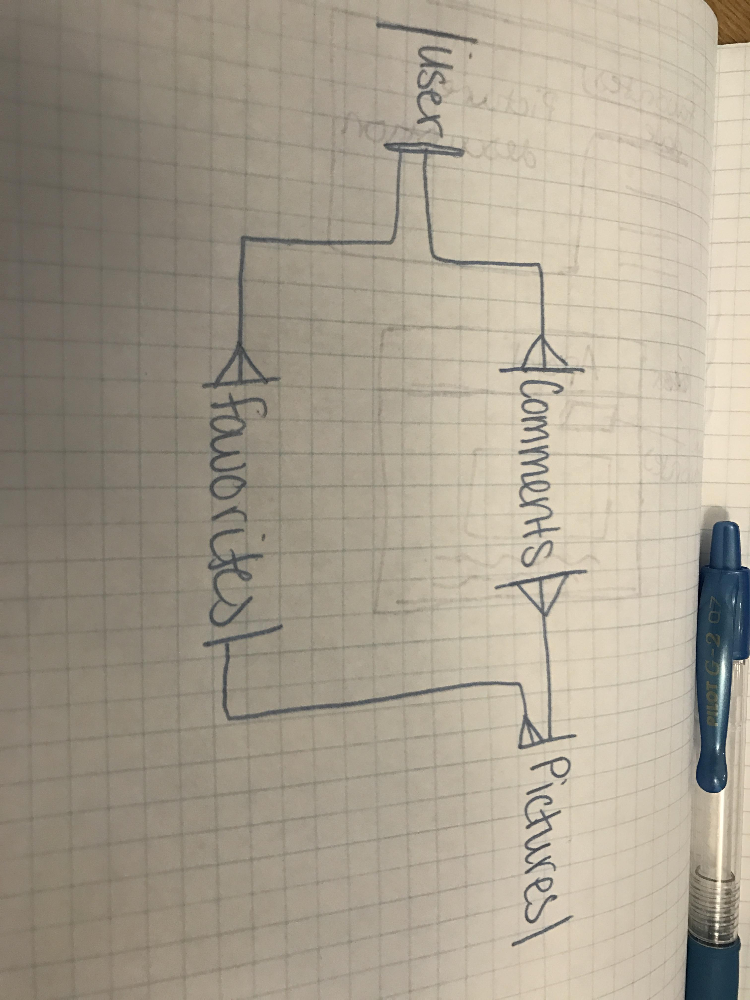

## Links

**Live site:** <https://ggwilliams.github.io/pictures-app-client/>

**Front End Repo:** <https://github.com/ggwilliams/pictures-app-client>

## ERD
1st ERD:


## About
To create an app that would view the NASA Astronomy Picture of the Day website and save the users favorite pictures and also allow users to comment on those pictures, I needed to have 3 tables. A table for pictures that would save the pictures, a table for favorites, and a table for comments.

To begin, I created the table for pictures. I needed scripts to test this feature also.

This is my create pictures script. This script doesn't need a user token because only favorites and comments belong to the user.
```
API="${API_ORIGIN:-http://localhost:4741}"
URL_PATH="/pictures"
TOKEN="BAhJIiViY2E3OThhYjczMDk2ODNiM2ZiMWRlZGNhNjcxYjQyNwY6BkVG--28c4215497d4c3103dca2c2fb034051b681f16d7"
curl "${API}${URL_PATH}" \
 --include \
 --request POST \
 --header "Content-Type: application/json" \
 --header "Authorization: Token token=$TOKEN" \
 --data '{
   "picture": {
     "title": "'"${TITLE}"'"
   }
 }'

 echo
```
Once the pictures table and scripts worked correctly, I added the favorites table. This table authenticates the user since only the user should be able to see and create their own favorites.

This is the update script for creating a favorite.
```
#!/bin/bash

API="${API_ORIGIN:-http://localhost:4741}"
URL_PATH="/favorites/${ID}"
curl "${API}${URL_PATH}" \
  --include \
  --request PATCH \
  --header "Content-Type: application/json" \
  --header "Authorization: Token token=$TOKEN" \
  --data '{
    "favorite": {
      "picture_id": "'"${PICTURE_ID}"'"
    }
  }'
echo
```

After favorites, I created the users comments on pictures. This would serve as a join table between users and pictures since users have many comments and pictures have many users.

## User Stories relevant to this repo

### Authentication

| Verb   | URI Pattern            | Controller#Action |
|--------|------------------------|-------------------|
| POST   | `/sign-up`             | `users#signup`    |
| POST   | `/sign-in`             | `users#signin`    |
| PATCH  | `/change-password/:id` | `users#changepw`  |
| DELETE | `/sign-out/:id`        | `users#signout`   |

#### POST /sign-up

Request:

```sh
curl http://localhost:4741/sign-up \
  --include \
  --request POST \
  --header "Content-Type: application/json" \
  --data '{
    "credentials": {
      "email": "'"${EMAIL}"'",
      "password": "'"${PASSWORD}"'",
      "password_confirmation": "'"${PASSWORD}"'"
    }
  }'
```

```sh
EMAIL=ava@bob.com PASSWORD=hannah scripts/sign-up.sh
```

Response:

```md
HTTP/1.1 201 Created
Content-Type: application/json; charset=utf-8

{
  "user": {
    "id": 1,
    "email": "ava@bob.com"
  }
}
```

#### POST /sign-in

Request:

```sh
curl http://localhost:4741/sign-in \
  --include \
  --request POST \
  --header "Content-Type: application/json" \
  --data '{
    "credentials": {
      "email": "'"${EMAIL}"'",
      "password": "'"${PASSWORD}"'"
    }
  }'
```

```sh
EMAIL=ava@bob.com PASSWORD=hannah scripts/sign-in.sh
```

Response:

```md
HTTP/1.1 200 OK
Content-Type: application/json; charset=utf-8

{
  "user": {
    "id": 1,
    "email": "ava@bob.com",
    "token": "BAhJIiVlZDIwZTMzMzQzODg5NTBmYjZlNjRlZDZlNzYxYzU2ZAY6BkVG--7e7f77f974edcf5e4887b56918f34cd9fe293b9f"
  }
}
```

#### PATCH /change-password/:id

Request:

```sh
curl --include --request PATCH "http://localhost:4741/change-password/$ID" \
  --header "Authorization: Token token=$TOKEN" \
  --header "Content-Type: application/json" \
  --data '{
    "passwords": {
      "old": "'"${OLDPW}"'",
      "new": "'"${NEWPW}"'"
    }
  }'
```

```sh
ID=1 OLDPW=hannah NEWPW=elle TOKEN=BAhJIiVlZDIwZTMzMzQzODg5NTBmYjZlNjRlZDZlNzYxYzU2ZAY6BkVG--7e7f77f974edcf5e4887b56918f34cd9fe293b9f scripts/change-password.sh
```

Response:

```md
HTTP/1.1 204 No Content
```

#### DELETE /sign-out/:id

Request:

```sh
curl http://localhost:4741/sign-out/$ID \
  --include \
  --request DELETE \
  --header "Authorization: Token token=$TOKEN"
```

```sh
ID=1 TOKEN=BAhJIiVlZDIwZTMzMzQzODg5NTBmYjZlNjRlZDZlNzYxYzU2ZAY6BkVG--7e7f77f974edcf5e4887b56918f34cd9fe293b9f scripts/sign-out.sh
```

Response:

```md
HTTP/1.1 204 No Content
```

### Users

| Verb | URI Pattern | Controller#Action |
|------|-------------|-------------------|
| GET  | `/users`    | `users#index`     |
| GET  | `/users/1`  | `users#show`      |

#### GET /users

Request:

```sh
curl http://localhost:4741/users \
  --include \
  --request GET \
  --header "Authorization: Token token=$TOKEN"
```

```sh
TOKEN=BAhJIiVlZDIwZTMzMzQzODg5NTBmYjZlNjRlZDZlNzYxYzU2ZAY6BkVG--7e7f77f974edcf5e4887b56918f34cd9fe293b9f scripts/users.sh
```

Response:

```md
HTTP/1.1 200 OK
Content-Type: application/json; charset=utf-8

{
  "users": [
    {
      "id": 2,
      "email": "bob@ava.com"
    },
    {
      "id": 1,
      "email": "ava@bob.com"
    }
  ]
}
```

#### GET /users/:id

Request:

```sh
curl --include --request GET http://localhost:4741/users/$ID \
  --header "Authorization: Token token=$TOKEN"
```

```sh
ID=2 TOKEN=BAhJIiVlZDIwZTMzMzQzODg5NTBmYjZlNjRlZDZlNzYxYzU2ZAY6BkVG--7e7f77f974edcf5e4887b56918f34cd9fe293b9f scripts/user.sh
```

Response:

```md
HTTP/1.1 200 OK
Content-Type: application/json; charset=utf-8

{
  "user": {
    "id": 2,
    "email": "bob@ava.com"
  }
}
```
